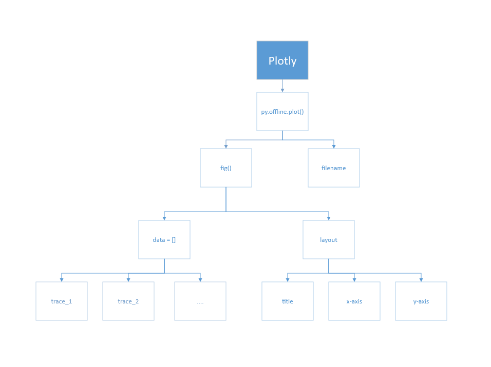
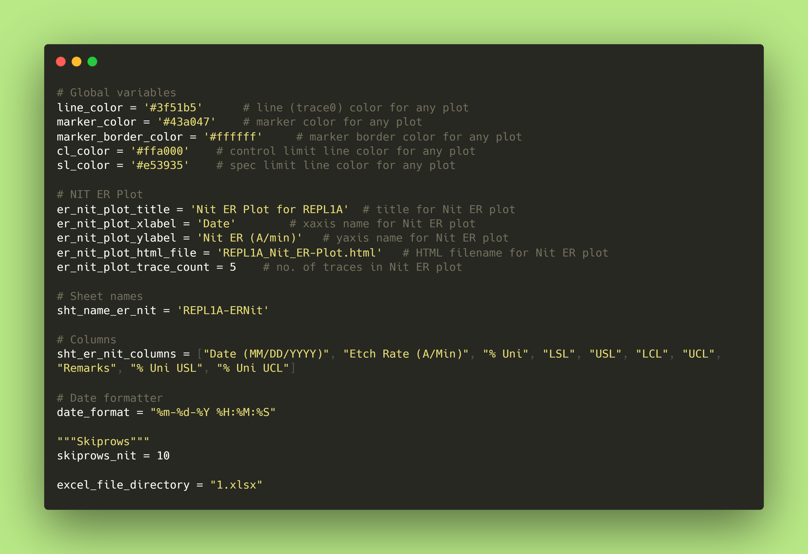
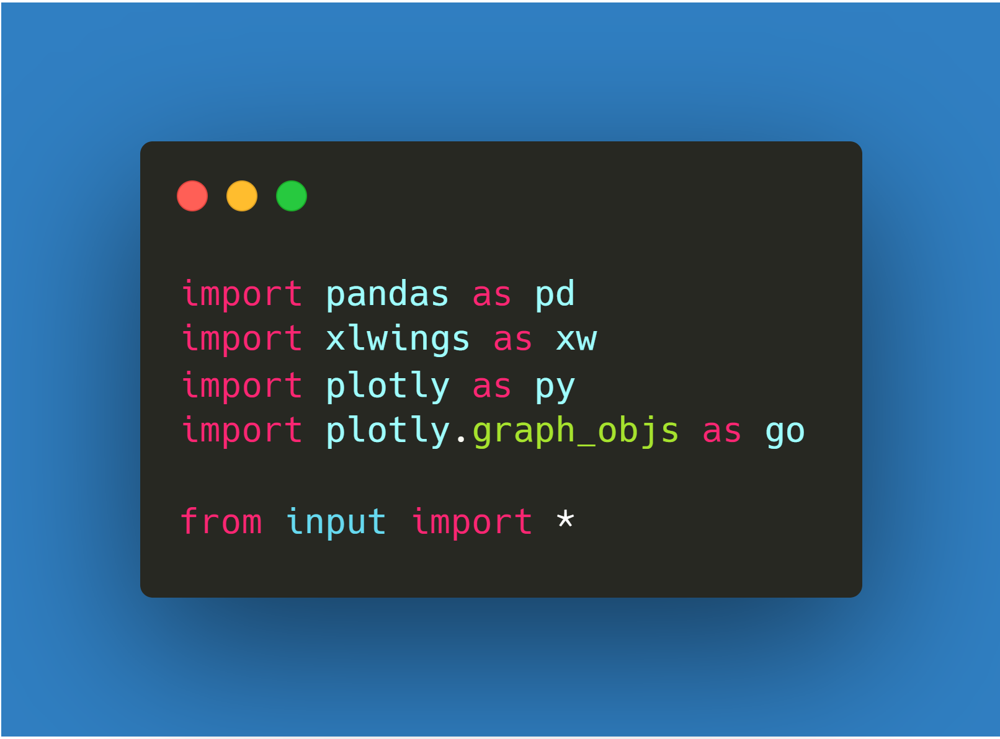
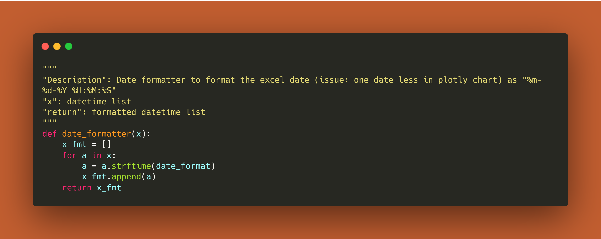
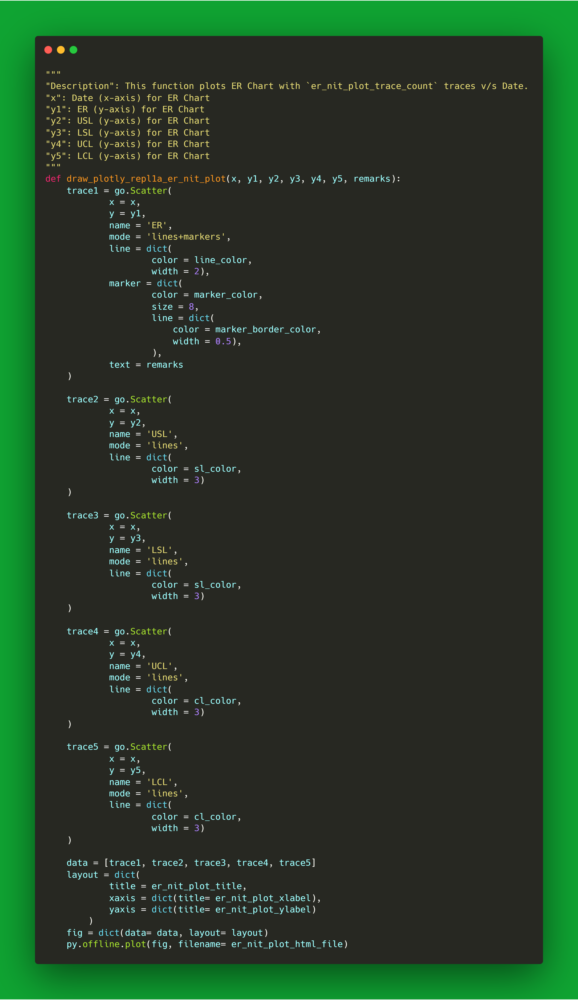
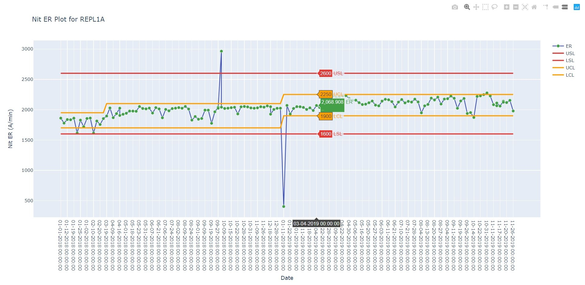
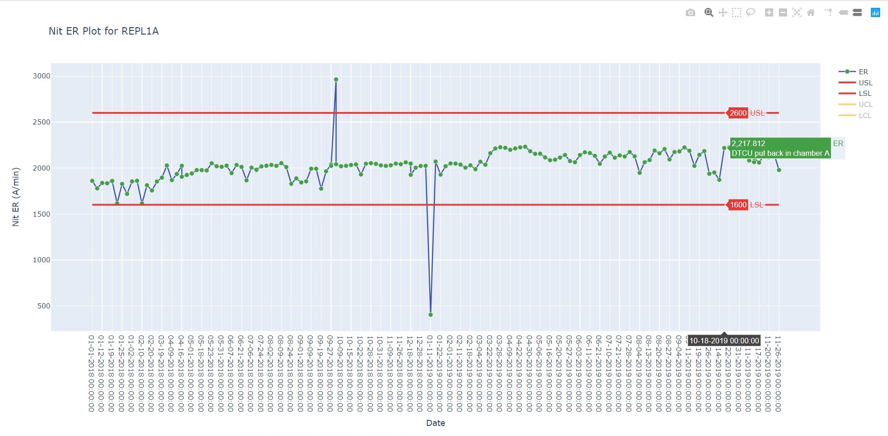

# Explore Data Visualization tool: Plotly | Part 1
## My Journey
In the data science field, it is very important to view the data in the best way possible. And trust me, it was very difficult for me to finally lock on to that ultimate tool on which you can rely for the best data visualization.

It has been almost an year, staying in "Data Science" field. I have done over 30 big projects. All are listed in my [Github profile](https://github.com/abhi3700).

## Project Brief
I started with my office project in Semiconductor field. The data model was somewhat like this....

<p align="center">
  
</p>

Here, there are around 5 charts which needs to be generated. And that used to be done using Microsoft Excel chart, which is non-interactive. If you are familiar with Microsoft charts, you might have seen that there are data which needs to be filtered, in order to see a portion of the entire chart. For this, charts need to be interactive. So, I tried with several Python-based libraries like Matplotlib, etc...

There was 2 objectives:
	1. Automate Plotting of the entire chart using a button. 
	2. Interactive chart with 'Remarks' information on hovering over a data point.

This is how it should be...

<p align="center">
  
</p>

In the chart above, there is no need to filter the data in order to view it properly. The filtering is handled automatically using [pandas](https://pypi.org/project/pandas/) library in Python.

## Plotly
So, I found [Plotly](https://pypi.org/project/plotly/) as the best data visualization package in Python. In this series, I will highlight the Python code snippets using which one can easily plot any type of charts - Scatter Plots, Line charts, Bar charts, Pie charts, Bubble charts, Gantt charts, Treemap charts, dot plots and so on.

> Plotly is an open-sourced library. It is available in both Free & Paid mode. In paid mode, one has the previlege to import standard data (x, y values) and plot respective charts. Also, they get to upload their charts & create a URL which will be available to plotly users. But in Free mode, one has to write the code and then plot the chart. Although the same GUI (in Paid) can be created as open-source project. Plotly has commercial offerings such as [Dash Enterprise](https://plot.ly/dash) & [Chart Studio Enterprise](https://plot.ly/online-chart-maker/)


In this series, we will explore the functions available in the Plotly tool. In the plotly website, the python code snippets could be confusing at times. I personally faced that issue. And that's the reason I thought to start the series.
> The offline Plotly will be detailed in this series. So, that one can use the charts in their office (like in my case) or in any other organization/companies for __FREE__.

## Code snippets (in Python)
Here, I will take the data (x, y) values and simply plot. I will not go into the filtering of the data, which can be done using python library - `pandas`.

The code snippet is drawn into the skeleton:
<p align="center">
  
</p>

### Input
All the input has been put separate in order to incorporate changes easily into code. As the parameter might be used in many places, so one time change in this file could be much more convenient.
<p align="center">
  
</p>


### Import packages
Here, we import packages - pandas, plotly. We will not be using xlwings here, but gets used with integrating with Excel via some button.
<p align="center">
  
</p>

### Date formatter function
This function is important to parse dates into the plotly chart as `00:00:00` when there is no dates given as input. So, please ensure the format like this `"%m-%d-%Y %H:%M:%S` where, m, d, Y sequence can be altered.
<p align="center">
  
</p>

### Draw Plotly chart function
A function has been created to fit to the paramters - 1 x (x) and 5 y (y1, y2, y3, y4, y5) traces.

<p align="center">
  
</p>

Like in this case, 5 traces are to be plotted in the same chart, with comparable set of values. That's why you have to create `trace1`, `trace2`, `trace3`, `trace4`, `trace5`.

Each trace has an option to choose the color along with 'line width'. Also, the marker color gets to be chosen aling with the 'width'.

All those traces has to be inserted in an array - `data`.
```py
    data = [trace1, trace2, trace3, trace4, trace5]
```

Then, comes the layout of the chart. Here, title is defined for x-axis & y-axis and the chart's title on the top is defined as well.
```py
    layout = dict(
            title = er_nit_plot_title,
            xaxis = dict(title= er_nit_plot_xlabel),
            yaxis = dict(title= er_nit_plot_ylabel)
        )
```

Then comes the figure which includes 2 main parameters - `data` & `layout`.
```py
    fig = dict(data= data, layout= layout)
```

Finally, comes the offline plot function, where 2 main params is required - figure & filename.
```py
    py.offline.plot(fig, filename= er_nit_plot_html_file)
```

### Define Main function
For convenience, this has been divided into 3 main parts - `fetch & clean data`, `define variables for chart function` & `call chart function`.

For fetching & cleaning data, the most widely used lib - `pandas` has been used for this purpose.

First, fetching the excel sheet using 
```py
    excel_file = pd.ExcelFile(excel_file_directory)
```

Second, parse the excel sheet via
```py
    df_repl1a_er_nit = excel_file.parse(sht_name_er_nit, skiprows=skiprows_nit)
```

Third, filter the required columns __"["Date (MM/DD/YYYY)", "Etch Rate (A/Min)", "% Uni", "LSL", "USL", "LCL", "UCL", "Remarks", "% Uni USL", "% Uni UCL"]"__ using this:
```py
    df_repl1a_er_nit = df_repl1a_er_nit[sht_er_nit_columns]
```

Fourth, replace empty cells in the Remarks column with __'.'__, so that it gets shown in the chart.
```py
    df_repl1a_er_nit['Remarks'].fillna('.', inplace=True)
```

Fifth, dropping rows where at least one element is missing
```py
    df_repl1a_er_nit.dropna(inplace=True)
```

Now, create the variables for the chart function.
```py
    df_repl1a_er_nit_date = df_repl1a_er_nit["Date (MM/DD/YYYY)"]
    df_repl1a_er_nit_er = df_repl1a_er_nit["Etch Rate (A/Min)"]
    df_repl1a_er_nit_usl = df_repl1a_er_nit["USL"]
    df_repl1a_er_nit_lsl = df_repl1a_er_nit["LSL"]
    df_repl1a_er_nit_ucl = df_repl1a_er_nit["UCL"]
    df_repl1a_er_nit_lcl = df_repl1a_er_nit["LCL"]
    df_repl1a_er_nit_unif = df_repl1a_er_nit["% Uni"]
    df_repl1a_er_nit_unif_usl = df_repl1a_er_nit["% Uni USL"]
    df_repl1a_er_nit_unif_ucl = df_repl1a_er_nit["% Uni UCL"]
    df_repl1a_er_nit_remarks = df_repl1a_er_nit["Remarks"]
```

Lastly, just call the plotly chart function with different params as the input.
```py
    draw_plotly_repl1a_er_nit_plot(
        x = date_formatter(df_repl1a_er_nit_date), 
        y1 = df_repl1a_er_nit_er,
        y2 = df_repl1a_er_nit_usl, 
        y3 = df_repl1a_er_nit_lsl,
        y4 = df_repl1a_er_nit_ucl,
        y5 = df_repl1a_er_nit_lcl,
        remarks = df_repl1a_er_nit_remarks
        )
```

This would open a beautiful chart with lots of functionalities inside like disabling any of the trace and viewing the other traces.
<p align="center">
  
</p>

Below is the chart with 'LCL', 'UCL' disabled.
<p align="center">
  
</p>

## Code repository
You can find the coding repository [here]( https://github.com/abhi3700/My_Work/tree/master/blogs/understanding_plotly_series/coding/1)

## Summary
This article might have shown you the scope of visualizing charts in the most beautiful way possible in Python environment. Compared to early packages like `matplotlib`, this functions really well and has an beauty edge over any other package to my knowledge. 

The __Remarks__ notes are very important when we have huge amount of datasets. On a particular date, whatever event occurred with whatever information we possess, has to be highlighted in the chart.

> Infact, I have sticked to Plotly charts for an year almost as of now. And I just loved the way different charts get created here. Also, the amount of customization that Plotly allows you to make, is completely second to none.

This is just scratching the surface, because frankly speaking there are a lot more waiting for you in the future tutorials in the series.

That's it for now!

Thank you for reading the article :)

### Contact me via
Email — dalvath3700@gmail.com <br/>
Github - https://github.com/abhi3700 <br/>
Telegram - https://t.me/abhi3700 <br/>
Steemit - https://steemit.com/@abhi3700 <br/>
LinkedIn - https://www.linkedin.com/in/abhi3700/ <br/>
Twitter - https://twitter.com/abhi3700 <br/>
Medium - https://medium.com/@abhi3700 <br/>
Facebook - https://www.facebook.com/abhi3700 <br/>