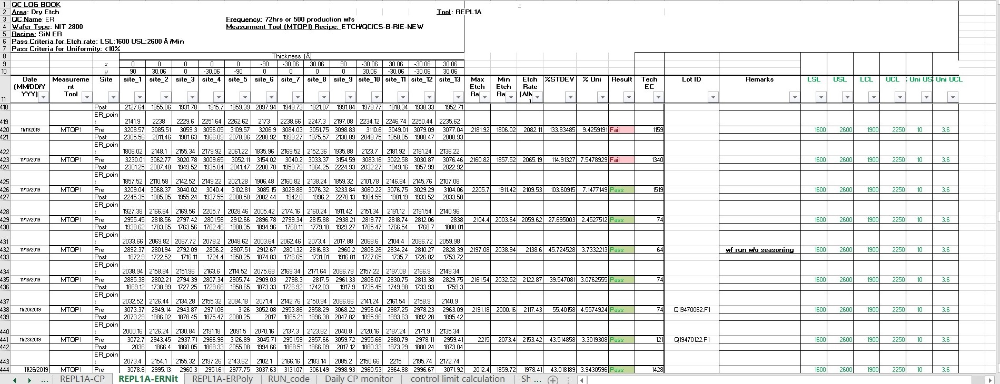

# Explore Data Visualization tool: Plotly | Part 1
## My Journey
In the data science field, it is very important to view the data in the best way possible. And trust me, it was very difficult for me to finally lock on to that ultimate tool on which you can rely for the best data visualization.

It has been almost an year, staying in "Data Science" field. I have done over 30 big projects. All are listed in my [Github profile](https://github.com/abhi3700).

## Project Brief
I started with my office project in Semiconductor field. The data model was somewhat like this....

  

Here, there are around 5 charts which needs to be generated. And that used to be done using Microsoft Excel chart, which is non-interactive. If you are familiar with Microsoft charts, you might have seen that there are data which needs to be filtered. This is because, we want to see a portion of the entire chart. For this, charts need to be interactive. This is how it works...

  

In the chart above, there is no need to filter the data in order to view it properly.

